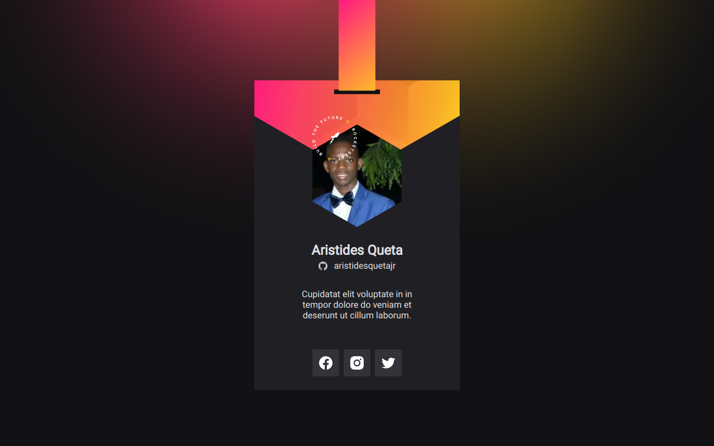

# Cracha NLW

A inovação surge quando a tecnologia se encontra com a expressão criativa. O Crachá virtual DoWhile é um testemunho poderoso dessa fusão, ao unir as informações do usuário provenientes da API do GitHub e imergi-las em um design personalizado, refletindo a essência do evento DoWhile 2021.

## Preview

## Tecnologias
- Figma [Link do projecto][figma-link]
- HTML5 - CSS3 - JavaScript

<!-- MARKDOWN LINKS -->
[figma-link]: https://www.figma.com/file/ofjzLSLUssYaCZMSja17ax/%5BNLW-Heat---Mission%3A-Origin%5D-DoWhile2021-(Community)?type=design&mode=design&t=MVxEy3uXCWFdPI7s-1